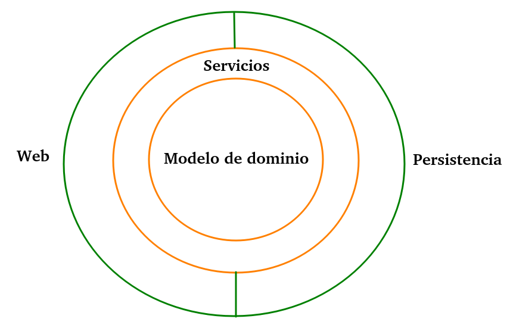

# API de supermercado
 
API RESTful para la gestión de los recursos de un supermercado (productos, categorías, compras, clientes, etc) usando Java y Spring Boot. Este proyecto se realizó aplicando buenos principios y técnicas de desarrollo, especificamente se uso la arquitectura de Capas orientada al dominio.

***
 
### Configuración
* Requerimentos
	1. OpenJDK versión 11
	2. PostgreSQL versión 15.3
    3. pgAdmin
    4. IDE IntelliJ IDEA
    5. Postman

* Dependencias utilizadas para la construcción y funcionamiento de este proyecto  
    1. [Spring Boot Starter Web](https://mvnrepository.com/artifact/org.springframework.boot/spring-boot-starter-web)
    2. [Spring Boot Starter Data JPA](https://mvnrepository.com/artifact/org.springframework.boot/spring-boot-starter-data-jpa)
    3. [SpringFox Boot Starter](https://mvnrepository.com/artifact/io.springfox/springfox-boot-starter)
    4. [PostgreSQL JDBC Driver](https://mvnrepository.com/artifact/org.postgresql/postgresql)
    5. [MapStruct Core](https://mvnrepository.com/artifact/org.mapstruct/mapstruct)
    6. [MapStruct Processor](https://mvnrepository.com/artifact/org.mapstruct/mapstruct-processor)
  
* Ejecución de la aplicacióń
    1. Ejecutar desde la terminal de linea de comandos la siguiente instrucción:  
    `git clone https://github.com/Samuel24Z/api-rest-supermercado.git`
    2. Importar el archivo `schema.sql` que se encuentra encuentra en la carpeta database de este proyecto, hacia la base de datos.
    3. Importar el archivo `data.sql` que se encuentra encuentra en la carpeta database de este proyecto, hacia la base de datos.
    4. Desde el IDE IntelliJ IDEA abrir el proyecto clonado en el primer paso.
    5. Ejecutar el proyecto desde la terminal de linea de comandos por medio de un archivo jar o bien, usando el IDE IntelliJ IDEA.

* Secciones de la aplicación
    1. Acceder a la API sin Postman en localhost:8090/market/api/{recurso}/peticion
    Los dos recursos a los que se puede acceder son:  
        - /products
        - /purchasess
    2. Acceder a la documentación de la API que ofrece Swagger en localhost:8090/market/api/swagger-ui/index.html
 
***
### Arquitectura de la aplicación
En la siguiente figura se muestra una representación de la arquitectura usada en este proyecto.

***
### Pruebas de la API
Las pruebas de esta API se pueden observar en el siguiente [enlace](/Pruebas.md).